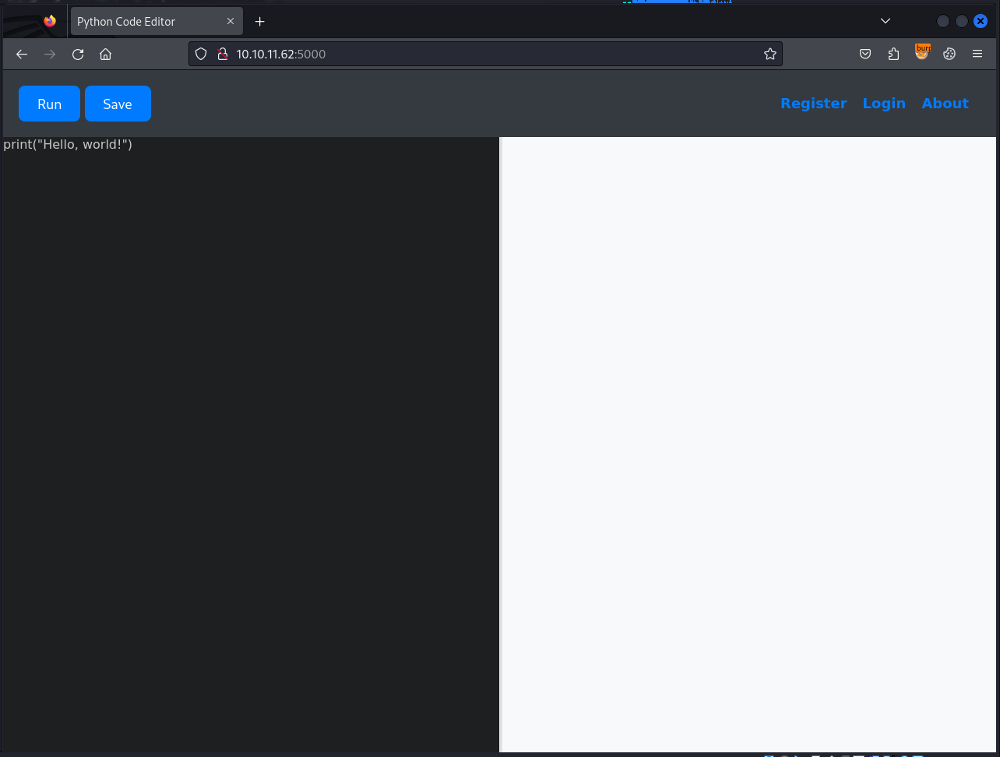
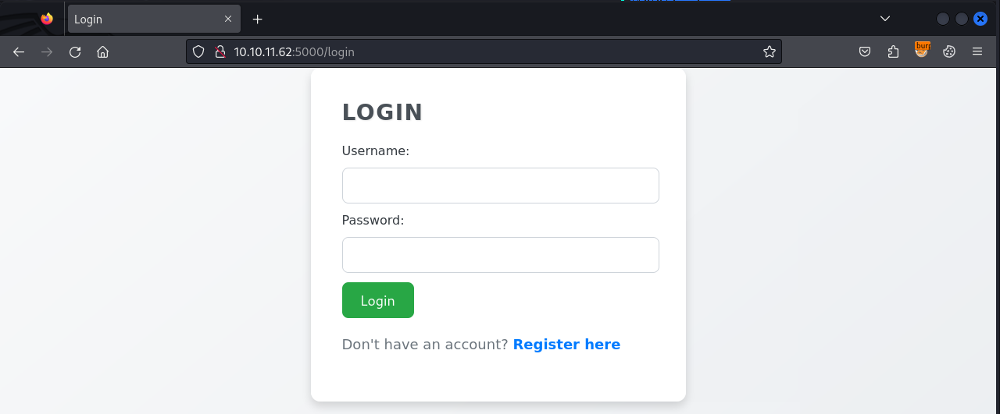
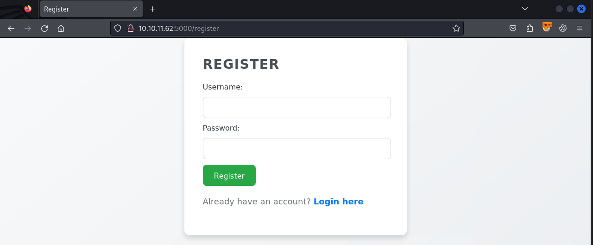
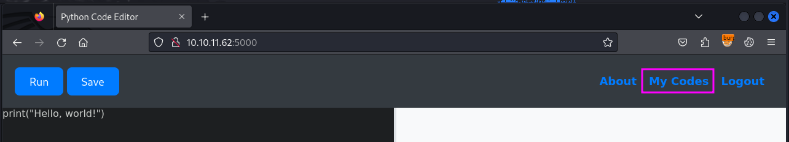
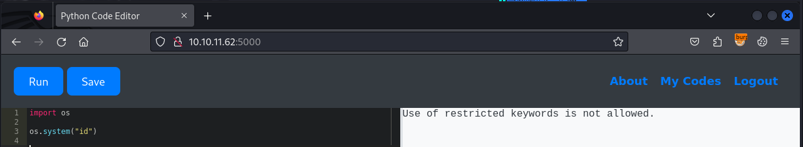
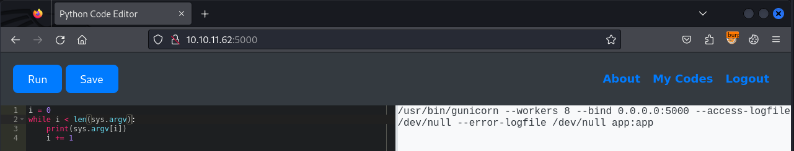
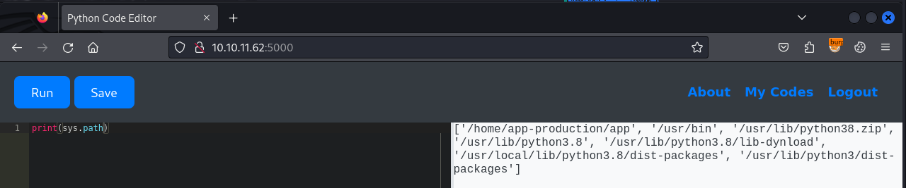

# Cat

## Enumeration

```
$ nmap -p- 10.10.11.62            
Starting Nmap 7.94SVN ( https://nmap.org ) at 2025-03-27 08:39 EDT
Nmap scan report for 10.10.11.62
Host is up (0.033s latency).
Not shown: 65533 closed tcp ports (conn-refused)
PORT     STATE SERVICE
22/tcp   open  ssh
5000/tcp open  upnp

Nmap done: 1 IP address (1 host up) scanned in 29.38 seconds

$ nmap -p22,5000 -sC -sV 10.10.11.62
Starting Nmap 7.94SVN ( https://nmap.org ) at 2025-03-27 08:39 EDT
Nmap scan report for 10.10.11.62
Host is up (0.029s latency).

PORT     STATE SERVICE VERSION
22/tcp   open  ssh     OpenSSH 8.2p1 Ubuntu 4ubuntu0.12 (Ubuntu Linux; protocol 2.0)
| ssh-hostkey: 
|   3072 b5:b9:7c:c4:50:32:95:bc:c2:65:17:df:51:a2:7a:bd (RSA)
|   256 94:b5:25:54:9b:68:af:be:40:e1:1d:a8:6b:85:0d:01 (ECDSA)
|_  256 12:8c:dc:97:ad:86:00:b4:88:e2:29:cf:69:b5:65:96 (ED25519)
5000/tcp open  http    Gunicorn 20.0.4
|_http-server-header: gunicorn/20.0.4
|_http-title: Python Code Editor
Service Info: OS: Linux; CPE: cpe:/o:linux:linux_kernel

Service detection performed. Please report any incorrect results at https://nmap.org/submit/ .
Nmap done: 1 IP address (1 host up) scanned in 8.10 seconds
```

looks like `Gunicorn` is running on port 5000. update `/etc/hosts` file to include `code` and  `code.htb`
```
$ cat /etc/hosts
10.10.11.62     code code.htb
```

open burpsuite and browse to `http://10.10.11.62:5000`



it appears to be 





register for an account with creds `test:test` and login. there is now a `My Codes` header




i still can't run or save code in the editor (click on buttons and nothing happens). look at the source code and see an error that it can't load javascript sources. this is pretty important because ace is being used for the site's functionality. reload once w/o burp and i can interact now. 

now see what i can do to get execution on the machine. try using `system` function but get an execution error



curious now what the restricted keywords are. through a bit of trial and error and thinking about what would be important for an attacker, i got the following list:

* system
* import
* os
* subprocess
* open
* read
* write
* exec

also found that the following was **not** blocked

* socket
* sys
* pty

i was able to find that the name/path of the ELF was `/usr/bin/gunicorn` via `print(sys.argv[0])`. so the `sys` module is imported. got a list of all the arguments as well, so we now know that the user/group running `gunicorn` is `app:app`. also got some information about the PATH and version of python





get a list of imported modules
```
0 : sys\n1 : builtins\n2 : _frozen_importlib\n3 : _imp\n4 : _warnings\n5 : _io\n6 : marshal\n7 : posix\n8 : _frozen_importlib_external\n9 : _thread\n10 : _weakref\n11 : time\n12 : zipimport\n13 : _codecs\n14 : codecs\n15 : encodings.aliases\n16 : encodings\n17 : encodings.utf_8\n18 : _signal\n19 : __main__\n20 : encodings.latin_1\n21 : _abc\n22 : abc\n23 : io\n24 : _stat\n25 : stat\n26 : _collections_abc\n27 : genericpath\n28 : posixpath\n29 : os.path\n30 : os\n31 : _sitebuiltins\n32 : _locale\n33 : _bootlocale\n34 : types\n35 : importlib._bootstrap\n36 : importlib._bootstrap_external\n37 : warnings\n38 : importlib\n39 : importlib.machinery\n40 : importlib.abc\n41 : _operator\n42 : operator\n43 : keyword\n44 : _heapq\n45 : heapq\n46 : itertools\n47 : reprlib\n48 : _collections\n49 : collections\n50 : _functools\n51 : functools\n52 : contextlib\n53 : importlib.util\n54 : zope\n55 : apport_python_hook\n56 : sitecustomize\n57 : site\n58 : enum\n59 : _sre\n60 : sre_constants\n61 : sre_parse\n62 : sre_compile\n63 : copyreg\n64 : re\n65 : __future__\n66 : binascii\n67 : fnmatch\n68 : errno\n69 : zlib\n70 : _compression\n71 : _weakrefset\n72 : threading\n73 : _bz2\n74 : bz2\n75 : _lzma\n76 : lzma\n77 : pwd\n78 : grp\n79 : shutil\n80 : _struct\n81 : struct\n82 : zipfile\n83 : weakref\n84 : pkgutil\n85 : platform\n86 : math\n87 : _datetime\n88 : datetime\n89 : xml\n90 : xml.parsers\n91 : pyexpat.errors\n92 : pyexpat.model\n93 : pyexpat\n94 : xml.parsers.expat.model\n95 : xml.parsers.expat.errors\n96 : xml.parsers.expat\n97 : plistlib\n98 : email\n99 : email.errors\n100 : _string\n101 : string\n102 : email.quoprimime\n103 : base64\n104 : email.base64mime\n105 : quopri\n106 : email.encoders\n107 : email.charset\n108 : email.header\n109 : _bisect\n110 : bisect\n111 : _sha512\n112 : _random\n113 : random\n114 : _socket\n115 : collections.abc\n116 : select\n117 : selectors\n118 : socket\n119 : urllib\n120 : ipaddress\n121 : urllib.parse\n122 : locale\n123 : calendar\n124 : email._parseaddr\n125 : email.utils\n126 : email._policybase\n127 : email.feedparser\n128 : email.parser\n129 : tempfile\n130 : textwrap\n131 : _opcode\n132 : opcode\n133 : dis\n134 : token\n135 : tokenize\n136 : linecache\n137 : inspect\n138 : ntpath\n139 : pkg_resources.extern\n140 : pkg_resources._vendor\n141 : pkg_resources.extern.six\n142 : pkg_resources._vendor.six\n143 : pkg_resources.extern.six.moves\n144 : pkg_resources._vendor.six.moves\n145 : pkg_resources.py31compat\n146 : pkg_resources.extern.appdirs\n147 : pkg_resources._vendor.packaging.__about__\n148 : pkg_resources.extern.packaging\n149 : pkg_resources.extern.packaging._structures\n150 : pkg_resources.extern.packaging.version\n151 : pkg_resources.extern.packaging._compat\n152 : pkg_resources.extern.packaging.specifiers\n153 : copy\n154 : pprint\n155 : traceback\n156 : pkg_resources.extern.pyparsing\n157 : pkg_resources.extern.six.moves.urllib\n158 : pkg_resources.extern.packaging.markers\n159 : pkg_resources.extern.packaging.requirements\n160 : pkg_resources.py2_warn\n161 : sysconfig\n162 : pkg_resources\n163 : gunicorn\n164 : gunicorn.app\n165 : gunicorn.errors\n166 : _ast\n167 : ast\n168 : _ctypes\n169 : ctypes._endian\n170 : ctypes\n171 : signal\n172 : _posixsubprocess\n173 : subprocess\n174 : ctypes.util\n175 : fcntl\n176 : html.entities\n177 : html\n178 : atexit\n179 : logging\n180 : gunicorn.workers\n181 : gunicorn.util\n182 : gunicorn.pidfile\n183 : gunicorn.sock\n184 : gunicorn.systemd\n185 : gunicorn.arbiter\n186 : gettext\n187 : argparse\n188 : shlex\n189 : _ssl\n190 : ssl\n191 : gunicorn.reloader\n192 : gunicorn.config\n193 : gunicorn.debug\n194 : gunicorn.app.base\n195 : gunicorn.app.wsgiapp\n196 : _compat_pickle\n197 : _pickle\n198 : pickle\n199 : _queue\n200 : queue\n201 : logging.handlers\n202 : socketserver\n203 : logging.config\n204 : gunicorn.glogging\n205 : gunicorn.http.unreader\n206 : gunicorn.http.errors\n207 : gunicorn.http.body\n208 : gunicorn.http.message\n209 : gunicorn.http.parser\n210 : gunicorn.http\n211 : gunicorn.http.wsgi\n212 : gunicorn.workers.workertmp\n213 : gunicorn.workers.base\n214 : gunicorn.workers.sync\n215 : typing.io\n216 : typing.re\n217 : typing\n218 : _json\n219 : json.scanner\n220 : json.decoder\n221 : json.encoder\n222 : json\n223 : _contextvars\n224 : contextvars\n225 : http\n226 : uu\n227 : email._encoded_words\n228 : email.iterators\n229 : email.message\n230 : http.client\n231 : mimetypes\n232 : http.server\n233 : werkzeug._internal\n234 : markupsafe._speedups\n235 : markupsafe\n236 : werkzeug.exceptions\n237 : werkzeug.datastructures.mixins\n238 : _hashlib\n239 : _blake2\n240 : _sha3\n241 : hashlib\n242 : urllib.response\n243 : urllib.error\n244 : urllib.request\n245 : werkzeug.sansio\n246 : werkzeug.sansio.http\n247 : werkzeug.http\n248 : werkzeug.datastructures.structures\n249 : werkzeug.datastructures.accept\n250 : werkzeug.datastructures.auth\n251 : werkzeug.datastructures.cache_control\n252 : werkzeug.datastructures.csp\n253 : werkzeug.datastructures.etag\n254 : werkzeug.datastructures.file_storage\n255 : werkzeug.datastructures.headers\n256 : werkzeug.datastructures.range\n257 : werkzeug.datastructures\n258 : werkzeug.urls\n259 : werkzeug.serving\n260 : dataclasses\n261 : werkzeug.sansio.multipart\n262 : unicodedata\n263 : hmac\n264 : secrets\n265 : werkzeug.security\n266 : werkzeug.sansio.utils\n267 : werkzeug.wsgi\n268 : werkzeug.utils\n269 : werkzeug.formparser\n270 : werkzeug.user_agent\n271 : werkzeug.sansio.request\n272 : werkzeug.wrappers.request\n273 : werkzeug.sansio.response\n274 : werkzeug.wrappers.response\n275 : werkzeug.wrappers\n276 : werkzeug.test\n277 : werkzeug\n278 : werkzeug.local\n279 : flask.globals\n280 : numbers\n281 : _decimal\n282 : decimal\n283 : _uuid\n284 : uuid\n285 : flask.json.provider\n286 : flask.json\n287 : click._compat\n288 : click.globals\n289 : click.utils\n290 : click.exceptions\n291 : click.types\n292 : click.parser\n293 : click.formatting\n294 : click.termui\n295 : click.core\n296 : click.decorators\n297 : click\n298 : werkzeug.routing.converters\n299 : difflib\n300 : werkzeug.routing.exceptions\n301 : werkzeug.routing.rules\n302 : werkzeug.routing.matcher\n303 : werkzeug.routing.map\n304 : werkzeug.routing\n305 : _csv\n306 : csv\n307 : pathlib\n308 : configparser\n309 : importlib.metadata\n310 : blinker._utilities\n311 : blinker.base\n312 : blinker\n313 : flask.signals\n314 : flask.helpers\n315 : flask.cli\n316 : flask.typing\n317 : flask.ctx\n318 : flask.sansio\n319 : flask.config\n320 : flask.logging\n321 : jinja2.bccache\n322 : jinja2.utils\n323 : jinja2.nodes\n324 : jinja2.exceptions\n325 : jinja2.visitor\n326 : jinja2.idtracking\n327 : jinja2.optimizer\n328 : jinja2.compiler\n329 : jinja2.async_utils\n330 : jinja2.runtime\n331 : jinja2.filters\n332 : jinja2.tests\n333 : jinja2.defaults\n334 : jinja2._identifier\n335 : jinja2.lexer\n336 : jinja2.parser\n337 : jinja2.environment\n338 : jinja2.loaders\n339 : jinja2\n340 : flask.templating\n341 : flask.sansio.scaffold\n342 : flask.sansio.app\n343 : itsdangerous.exc\n344 : itsdangerous.encoding\n345 : itsdangerous.signer\n346 : itsdangerous.serializer\n347 : itsdangerous.timed\n348 : itsdangerous._json\n349 : itsdangerous.url_safe\n350 : itsdangerous\n351 : flask.json.tag\n352 : flask.sessions\n353 : flask.wrappers\n354 : flask.app\n355 : flask.sansio.blueprints\n356 : flask.blueprints\n357 : flask\n358 : sqlalchemy.util.preloaded\n359 : sqlalchemy.cyextension\n360 : cython_runtime\n361 : _cython_3_0_10\n362 : gc\n363 : sqlalchemy.cyextension.collections\n364 : sqlalchemy.cyextension.immutabledict\n365 : sqlalchemy.cyextension.processors\n366 : sqlalchemy.cyextension.resultproxy\n367 : sqlalchemy.util.compat\n368 : sqlalchemy.exc\n369 : sqlalchemy.cyextension.util\n370 : sqlalchemy.util._has_cy\n371 : typing_extensions\n372 : sqlalchemy.util.typing\n373 : sqlalchemy.util._collections\n374 : concurrent\n375 : concurrent.futures._base\n376 : concurrent.futures\n377 : asyncio.constants\n378 : asyncio.format_helpers\n379 : asyncio.base_futures\n380 : asyncio.log\n381 : asyncio.coroutines\n382 : asyncio.exceptions\n383 : asyncio.base_tasks\n384 : _asyncio\n385 : asyncio.events\n386 : asyncio.futures\n387 : asyncio.protocols\n388 : asyncio.transports\n389 : asyncio.sslproto\n390 : asyncio.locks\n391 : asyncio.tasks\n392 : asyncio.staggered\n393 : asyncio.trsock\n394 : asyncio.base_events\n395 : asyncio.runners\n396 : asyncio.queues\n397 : asyncio.streams\n398 : asyncio.subprocess\n399 : asyncio.base_subprocess\n400 : asyncio.selector_events\n401 : asyncio.unix_events\n402 : asyncio\n403 : greenlet._greenlet\n404 : greenlet\n405 : sqlalchemy.util.langhelpers\n406 : sqlalchemy.util._concurrency_py3k\n407 : sqlalchemy.util.concurrency\n408 : sqlalchemy.util.deprecations\n409 : sqlalchemy.util\n410 : sqlalchemy.event.registry\n411 : sqlalchemy.event.legacy\n412 : sqlalchemy.event.attr\n413 : sqlalchemy.event.base\n414 : sqlalchemy.event.api\n415 : sqlalchemy.event\n416 : sqlalchemy.log\n417 : sqlalchemy.pool.base\n418 : sqlalchemy.pool.events\n419 : sqlalchemy.util.queue\n420 : sqlalchemy.pool.impl\n421 : sqlalchemy.pool\n422 : sqlalchemy.sql.roles\n423 : sqlalchemy.inspection\n424 : sqlalchemy.sql._typing\n425 : sqlalchemy.sql.visitors\n426 : sqlalchemy.sql.cache_key\n427 : sqlalchemy.sql.operators\n428 : sqlalchemy.sql.traversals\n429 : sqlalchemy.sql.base\n430 : sqlalchemy.sql.coercions\n431 : sqlalchemy.sql.annotation\n432 : sqlalchemy.sql.type_api\n433 : sqlalchemy.sql.elements\n434 : sqlalchemy.util.topological\n435 : sqlalchemy.sql.ddl\n436 : sqlalchemy.engine._py_processors\n437 : sqlalchemy.engine.processors\n438 : sqlalchemy.sql.sqltypes\n439 : sqlalchemy.sql.selectable\n440 : sqlalchemy.sql.schema\n441 : sqlalchemy.sql.util\n442 : sqlalchemy.sql.dml\n443 : sqlalchemy.sql.crud\n444 : sqlalchemy.sql.functions\n445 : sqlalchemy.sql.compiler\n446 : sqlalchemy.sql._dml_constructors\n447 : sqlalchemy.sql._elements_constructors\n448 : sqlalchemy.sql._selectable_constructors\n449 : sqlalchemy.sql.lambdas\n450 : sqlalchemy.sql.expression\n451 : sqlalchemy.sql.events\n452 : sqlalchemy.sql.naming\n453 : sqlalchemy.sql.default_comparator\n454 : sqlalchemy.sql\n455 : sqlalchemy.engine.interfaces\n456 : sqlalchemy.engine.util\n457 : sqlalchemy.engine.base\n458 : sqlalchemy.engine.events\n459 : sqlalchemy.dialects\n460 : sqlalchemy.engine.url\n461 : sqlalchemy.engine.mock\n462 : sqlalchemy.engine.create\n463 : sqlalchemy.engine.row\n464 : sqlalchemy.engine.result\n465 : sqlalchemy.engine.cursor\n466 : sqlalchemy.engine.reflection\n467 : sqlalchemy.engine\n468 : sqlalchemy.schema\n469 : sqlalchemy.types\n470 : sqlalchemy.engine.characteristics\n471 : sqlalchemy.engine.default\n472 : sqlalchemy\n473 : sqlalchemy.sql._orm_types\n474 : sqlalchemy.orm._typing\n475 : sqlalchemy.orm.base\n476 : sqlalchemy.orm.mapped_collection\n477 : sqlalchemy.orm.collections\n478 : sqlalchemy.orm.path_registry\n479 : sqlalchemy.orm.interfaces\n480 : sqlalchemy.orm.attributes\n481 : sqlalchemy.orm.util\n482 : sqlalchemy.orm.exc\n483 : sqlalchemy.orm.state\n484 : sqlalchemy.orm.instrumentation\n485 : sqlalchemy.future.engine\n486 : sqlalchemy.future\n487 : sqlalchemy.orm.context\n488 : sqlalchemy.orm.loading\n489 : sqlalchemy.orm.strategy_options\n490 : sqlalchemy.orm.descriptor_props\n491 : sqlalchemy.orm.relationships\n492 : sqlalchemy.orm.properties\n493 : sqlalchemy.orm.mapper\n494 : sqlalchemy.orm.query\n495 : sqlalchemy.orm.evaluator\n496 : sqlalchemy.orm.sync\n497 : sqlalchemy.orm.persistence\n498 : sqlalchemy.orm.bulk_persistence\n499 : sqlalchemy.orm.identity\n500 : sqlalchemy.orm.state_changes\n501 : sqlalchemy.orm.unitofwork\n502 : sqlalchemy.orm.session\n503 : sqlalchemy.orm._orm_constructors\n504 : sqlalchemy.orm.clsregistry\n505 : sqlalchemy.orm.decl_base\n506 : sqlalchemy.orm.decl_api\n507 : sqlalchemy.orm.strategies\n508 : sqlalchemy.orm.writeonly\n509 : sqlalchemy.orm.dynamic\n510 : sqlalchemy.orm.scoping\n511 : sqlalchemy.orm.events\n512 : sqlalchemy.orm.dependency\n513 : sqlalchemy.orm\n514 : flask_sqlalchemy.pagination\n515 : flask_sqlalchemy.query\n516 : flask_sqlalchemy.model\n517 : flask_sqlalchemy.session\n518 : flask_sqlalchemy.table\n519 : flask_sqlalchemy.extension\n520 : flask_sqlalchemy\n521 : flask_sqlalchemy.cli\n522 : sqlalchemy.dialects.sqlite.json\n523 : sqlalchemy.dialects.sqlite.base\n524 : sqlalchemy.dialects.sqlite.pysqlite\n525 : sqlalchemy.dialects.sqlite.aiosqlite\n526 : sqlalchemy.dialects.sqlite.pysqlcipher\n527 : sqlalchemy.dialects._typing\n528 : sqlalchemy.dialects.sqlite.dml\n529 : sqlalchemy.dialects.sqlite\n530 : _sqlite3\n531 : sqlite3.dbapi2\n532 : sqlite3\n533 : app\n534 : stringprep\n535 : encodings.idna\n
```


some interesting javascript in the source code

```
HTTP/1.1 200 OK
Server: gunicorn/20.0.4
Date: Thu, 27 Mar 2025 12:59:55 GMT
Connection: close
Content-Type: text/html; charset=utf-8
Content-Length: 3467
Vary: Cookie

<!-- index -->
<!DOCTYPE html>
<html lang="en">
<head>
    <meta charset="UTF-8">
    <meta name="viewport" content="width=device-width, initial-scale=1.0">
    <title>Python Code Editor</title>
    <link rel="stylesheet" href="https://cdnjs.cloudflare.com/ajax/libs/highlight.js/11.8.0/styles/default.min.css">
    <link rel="stylesheet" href="/static/css/styles.css">
</head>
<body>
<div id="header">
    <div>
        <button id="run-button">Run</button>
        <button id="save-button">Save</button>
    </div>
    <div class="auth-links">
        
        <a href="#" id="about-link">About</a>
        
            <a href="/codes" id="codes-link">My Codes</a>
            <a href="/logout" id="logout-link">Logout</a>
        
    </div>
</div>

<div class="container">
    <div id="editor">print("Hello, world!")</div>
    <div id="output"></div>
</div>

<div id="about-modal">
    <div id="about-modal-content">
        <h2>About Code</h2>
        <p>
            Welcome to Code, your go-to Python code editor! Code is designed to provide a seamless and intuitive experience for writing and running Python code directly in your browser.
        </p>
        <button id="about-close">Close</button>
    </div>
</div>

    <script src="https://cdnjs.cloudflare.com/ajax/libs/ace/1.4.12/ace.min.js"></script>
    <script src="https://cdnjs.cloudflare.com/ajax/libs/jquery/3.6.0/jquery.min.js"></script>
    <script>
        // Load the Ace editor modes and themes
        ace.config.set('basePath', 'https://cdnjs.cloudflare.com/ajax/libs/ace/1.4.12/');
        var editor = ace.edit("editor");
        editor.session.setMode("ace/mode/python");
        editor.setTheme("ace/theme/monokai");

	$.ajaxSetup({
            xhrFields: {
                withCredentials: true
            }
        });

        function runCode() {
            var code = editor.getValue();
            $.post('/run_code', {code: code}, function(data) {
                document.getElementById('output').textContent = data.output;
            });
        }

        function loadCode(codeId) {
            $.get('/load_code/' + codeId, function(data) {
                editor.setValue(data.code, -1);
            });
        }

        document.getElementById('run-button').addEventListener('click', runCode);
        document.getElementById('save-button').addEventListener('click', function() {
            var code = editor.getValue();
            var name = prompt("Please enter the name for this script:");
            if (name) {
                $.post('/save_code', {code: code, name: name}, function(response) {
                    alert(response.message);
                });
            }
        });

        // About modal functionality
        document.getElementById('about-link').addEventListener('click', function(event) {
            event.preventDefault();
            document.getElementById('about-modal').style.display = 'flex';
        });

        document.getElementById('about-close').addEventListener('click', function() {
            document.getElementById('about-modal').style.display = 'none';
        });

        // Check if code_id is provided in the URL
        var urlParams = new URLSearchParams(window.location.search);
        var codeId = urlParams.get('code_id');
        if (codeId) {
            loadCode(codeId);
        }
        document.getElementById('output').textContent = 'Click "Run" to execute code.';
    </script>
</body>
</html>
```